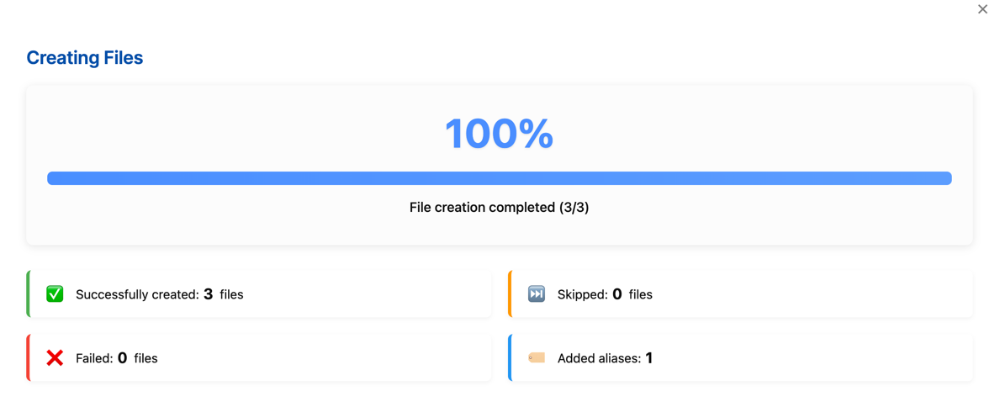

# Missing Link File Creator

English | [中文](./README.zh-cn.md)

An Obsidian plugin that detects and creates missing markdown files from links in your notes.

## Features

- **One-click creation** of missing files referenced in your notes
- **Smart link detection** for multiple link formats:
	- Standard links: `[[filename]]`
	- Links with aliases: `[[filename|alias]]`
	- Path-specific links: `[[path/to/filename]]`
	- Embedded links: `![[filename]]`
	- Links in resource directories: `[[resources/books/filename]]`
- **Bulk creation** of multiple missing files at once
- **Folder scanning** to create missing links from all notes in a folder
- **Alias preservation** - automatically adds aliases to frontmatter
- **Customizable default folder** for new files
- **Interactive confirmation dialog** to select which files to create
- **Template support** - populate new files using Templater templates
- **Rule system** - automatically apply different target folders and templates based on filename patterns

## Installation

1. Open Obsidian Settings > Community plugins
2. Disable Safe mode
3. Click "Browse" and search for "Missing Link File Creator"
4. Install the plugin and enable it

## Usage

### Commands

| Command | Description |
| ------- | ----------- |
| Create Files for Unresolved Links in Current File | Check the links in the currently open Markdown document and automatically create any missing linked files. |
| Scan Folder and Create Missing Files | Scan all Markdown files in the folder of the currently open document, detect their linked references, and automatically create any missing files. |
| Manage File Creation Rules | Open the rule management panel to create and edit file creation rules. |

Access these commands through the Command Palette (Ctrl/Cmd + P).

### Context Menu Feature

- Select text containing `[[links]]` in the editor
- Right-click to open the context menu
- Choose "Create Files for Selected Unresolved Links"
- The system will only process links within the selected text

## Configuration

In the plugin settings, you can:

### Basic Settings

1. **Set a default folder path** for new files:
	- Click on the folder field
	- Use the dropdown to search and select an existing folder
	- Files without specific paths will be created here

2. **Enable notifications** for file creation events

3. **Add aliases to frontmatter**: Whether to automatically add aliases from links to frontmatter (can be disabled when using with Templater)

4. **Enable debug mode** for troubleshooting (developers)

### Template Settings

- **Enable templates**: Use templates when creating new files
- **Set template folder**: Specify the folder containing template files

### Rule System

- **Enable rules**: Automatically apply different target folders and templates based on filename patterns
- **Manage rules**: Add, edit, and delete file creation rules

### File Creation Rules

The rule system allows you to automatically determine where new files are created and which templates to use based on filename patterns.

#### Creating Rules

1. Click "Manage Rules" in settings or use the "Manage File Creation Rules" command
2. Click "Add Rule" to create a new rule
3. Configure the rule content:
	- Rule name: A descriptive name for the rule's purpose
	- Match conditions: Configure multiple matching conditions (contains, starts with, ends with, exact match, regex)
	- Target folder: Files matching this rule will be created in this folder
	- Use template: Specify the template for creating files
	- Template alias handling: Control how aliases are handled when using Templater

#### Rule Matching Logic

- Multiple rules are evaluated in priority order
- Each rule can contain multiple conditions (AND, OR, NOT, EXCLUDE)
- The first matching rule will be applied
- You can adjust rule priority using up/down buttons

#### Condition Types Explained

When creating rules, you can use different condition types to create flexible matching logic:

- **AND**: All conditions must be satisfied
- **OR**: At least one condition must be satisfied
- **NOT**: The condition must not be satisfied
- **EXCLUDE**: Explicitly excludes files matching this condition

These conditions can be combined to build complex matching logic. For example, you can create a rule that matches "filenames containing 'character' but not starting with 'NPC'".

### Template Support

The plugin now supports using templates to create new files:

1. Enable "Enable Templates" in settings
2. Set the folder containing template files
3. You can specify different templates for specific filename patterns in rules
4. Supports basic variable replacement, such as {{filename}}, {{path}}, and {{aliases}}
5. Integrates with the Templater plugin for more powerful template functionality

### Templater Integration

When using templates, you can specify how aliases from links should be handled:

- **Skip**: Let Templater handle aliases. This is recommended when your template already has logic for managing aliases to avoid duplication.
- **Merge**: Automatically merge aliases from links with the template's frontmatter. This works for both array and list formats of the aliases field.

#### Templater Integration Details

When used with Templater, the following variables are automatically passed to templates:

- `{{filename}}`: Filename without path and extension
- `{{path}}`: Complete file path
- `{{aliases}}`: List of link aliases, comma-separated

In Templater templates, you can access these variables through TP.file.title, tp.file.path, etc., or use the following method:

```js
<%* 
// tp.frontmatter is used to access the source file's frontmatter
// Get passed aliases
const aliases = tp.frontmatter.aliases;
%>
```

### Workflow Example

1. Write notes with links to files you plan to create later:
   ```markdown
   I need to research [[Ancient Rome]] and its connection to [[Byzantine Empire|Byzantium]].
   Also check characters [[Caesar]] and [[Pompey]].
   ```

2. Set up a rule to place all files containing "character" in the "Characters" folder and use the "character" template

3. When ready to create these files:
	- Run the "Create Files for Unresolved Links in Current File" command
	- View matching rule information in the confirmation dialog
	- Select which files to create and confirm
	- Files will be created in appropriate locations according to rules, using specified templates




## Advanced Features

### Frontmatter Matching

The rule system supports matching files based on source file frontmatter properties:

1. Choose "Frontmatter" match type when creating a rule
2. Specify the property name and expected value
3. When the source file has matching frontmatter, the rule will be applied to created link files

### Context-Aware File Creation

When creating files, the plugin considers:
- Source file frontmatter data
- Source file location
- Specified file paths
- Matching rules

### Batch Operations

- Rules allow unified management of creation locations and content templates for many linked files
- Folder scanning mode can process all missing links in an entire folder at once

### Advanced Usage Examples

#### Advanced Rule Use Cases


##### Case 1: Auto-Organization for Fiction Writing Project

**Goal**: Automatically organize character, location, and plot notes for fiction writing

**Rule Setup**:
1. **Character Notes Rule**:
	- Rule name: "Attack on Titan - Character File Rule"
	- Condition type: "Starts with"
	- Match pattern: Filename, "Attack on Titan-Character—"
	- Operator: "AND"
	- Target folder: "Anime/Attack on Titan/Attack on Titan-Characters"
	- Use template: "Templates/Templater/M02-Attack on Titan/Templater-M02：1001-Attack on Titan-Character.md"
	- Alias handling: Merge aliases

```
- [[Attack on Titan-Character—Eren Yeager|Eren Yeager]]  
    Eren Yeager is the protagonist of "Attack on Titan," a young man filled with determination and a desire for revenge. Living in a world surrounded by massive walls, his mother's death during a Titan attack motivates him to join the Survey Corps and fight against the Titans with strong resolve. Later, he discovers his ability to transform into a Titan and inherits the powers of the "Attack Titan" and the "Founding Titan." Eren's personality gradually evolves from a straightforward, passionate youth to a complex and contradictory figure whose choices profoundly influence the direction of the story.
    
- [[Attack on Titan-Character—Mikasa Ackerman|Mikasa Ackerman]]  
    Mikasa Ackerman is Eren's childhood friend and protector, known for her remarkable combat skills and loyalty to Eren. She is a descendant of the Ackerman family, possessing extraordinary strength and reflexes beyond normal humans. After her parents were murdered when she was young, Eren saved her, and from then on, she regarded him as family, vowing to protect him. Mikasa is calm and decisive, but often shows emotion when Eren's safety is threatened. She is considered one of the strongest warriors in the series.
```


**Effect**:
- `[[Attack on Titan-Character—Eren Yeager|Eren Yeager]]`, `[[Attack on Titan-Character—Mikasa Ackerman|Mikasa Ackerman]]` and similar links
- Starting with "Attack on Titan-Character—", which satisfies the rule
  - Files will be populated by Templater using the corresponding `Templater-M02：1001-Attack on Titan-Character.md` template
  - Aliases will be added to the new files
  - These files will be automatically assigned to the appropriate folder `Anime/Attack on Titan/Attack on Titan-Characters`


2. **Event Notes Rule**:

- Rule name: "Attack on Titan-Event File Rule"
- Condition 1: Filename, "Starts with" + "Attack on Titan-Event—" + "AND"
- Condition 2: Filename, "Matches" + "draft" + "NOT"
- Target folder: "Anime/Attack on Titan/Attack on Titan-Events"
- Use template: "Templates/Templater/M01-Attack on Titan/Templater-M02：1002-Attack on Titan-Event.md"


```
- [[Attack on Titan-Event—The Fall of Shiganshina|The Fall of Shiganshina]]
    - The story of "Attack on Titan" revolves around the adventures of Eren Yeager, Mikasa Ackerman who was taken in by his family, and their childhood friend Armin Arlert. After Wall Maria, which protected their hometown, was destroyed by the Colossal Titan and the Armored Titan, Eren witnessed his mother being devoured by a Titan and vowed to exterminate all Titans.
- [[Attack on Titan-Event—Battle of Trost District-draft]]
    - Eren, Mikasa, and Armin joined the Training Corps and graduated five years later. At this time, Titans attacked Trost District near the second wall again. During the subsequent battle, Eren discovered his ability to transform into a Titan and successfully defended the district. This caught the attention of Survey Corps Commander Erwin Smith, who utilized Eren's power to reclaim Wall Maria and placed him under the supervision of Captain Levi and Squad Leader Hange.

```


**Effect**:

- `[[Attack on Titan-Event—The Fall of Shiganshina|The Fall of Shiganshina]]`, `[[Attack on Titan-Event—Battle of Trost District-draft]]` and similar links

- 1. `[[Attack on Titan-Event—The Fall of Shiganshina|The Fall of Shiganshina]]`matches both conditions in the rule, will be created with the template and assigned to the specified location

  - Files will be populated by Templater using the corresponding `Templater-M02：1002-Attack on Titan-Event.md` template
  - Aliases will be added to the new files
  - These files will be automatically assigned to the appropriate folder `Anime/Attack on Titan/Attack on Titan-Events`

- 2. `[[Attack on Titan-Event—Battle of Trost District-draft]]`matches Condition 1, but doesn't satisfy Condition 2 as it contains "draft"

  - No template data is applied
  - File will be automatically assigned to the default configured folder `TODO`


 


##### Case 2: Frontmatter-Based Intelligent Categorization

**Goal**: Organize notes based on source file frontmatter

**Rule Setup**:
1. **Source file frontmatter-based rule**:
	- Rule name: "Attack on Titan - Character Analysis Rule"
	- Condition 1: "Frontmatter" + "series" + "Attack on Titan" + "AND"
	- Condition 2: "Contains" + "Anime Analysis" + "AND" (matching categories in frontmatter)
	- Target folder: "Anime/Attack on Titan/Attack on Titan-Character Analysis"
	- Use template: "Templates/Templater/M01-Attack on Titan/Templater-M01：1005-Attack on Titan-Character Analysis.md"
	- Template alias handling: "Merge”

```
---
title: Attack on Titan Research Notes
series: Attack on Titan
creator: Hajime Isayama
categories:
  - Anime Analysis
  - Character Analysis
status: ongoing
---

- [[Eren Yeager Character Analysis]]

```


**Effect**:
- Links in documents with frontmatter parameters matching:
	- categories=Character Analysis
	- series=Attack on Titan
- Will match the "Attack on Titan - Character Analysis Rule”


  


### Notes

- Files with specific paths in links (e.g., `[[folder/file]]`) will be created in those locations
- Files without paths will be created in your default folder
- The plugin will not overwrite existing files unless you're adding new aliases
- For Templater usage, it's recommended to handle aliases in the template to avoid duplication

## Support

If you encounter any issues, please report them on the [GitHub repository](https://github.com/Lemon695/obsidian-missing-link-file-creator/issues).

## Plugin Use Cases

- **Knowledge Management**: Quickly create and organize related concept files while writing knowledge notes
- **Fiction Writing**: Create character, location, plot files during the writing process
- **Research Projects**: Automatically organize file structure based on different research topics
- **Course Notes**: Automatically categorize notes into appropriate folders based on course names

During document editing (e.g., "novel writing"), an article often exceeds 3,000 words, and many links, such as `[[Character Profiles]]` or `[[Task List]]`, are created during the writing process. However, these files may not have been created yet. With this plugin, you can quickly generate the corresponding files without manually creating them one by one, improving efficiency.

Through the rule system and template support, the plugin can greatly improve file management efficiency, allowing you to focus on content creation rather than file organization.

## Frequently Asked Questions (FAQ)

**Q: Why aren't my links being detected?**  
A: Make sure the link format is correct. This plugin supports Wiki links in the `[[link]]` format, not standard Markdown links `[text](link)`.

**Q: How do I avoid duplicate aliases when creating files?**  
A: When using Templater, it's recommended to select "Skip" for alias handling in rules, letting Templater handle aliases to avoid duplication.

**Q: How do I apply different templates to different types of notes?**  
A: Create multiple rules with different matching conditions (such as filenames containing specific keywords), and specify different templates for each rule.

**Q: How do I change the priority of created rules?**  
A: In the rule management interface, use the up/down buttons next to each rule to adjust rule order. Rules at the top of the list have higher priority.

**Q: Can I use regular expressions in matching conditions?**  
A: Yes, you can select the "regex" match type to use regular expressions for more complex pattern matching.
