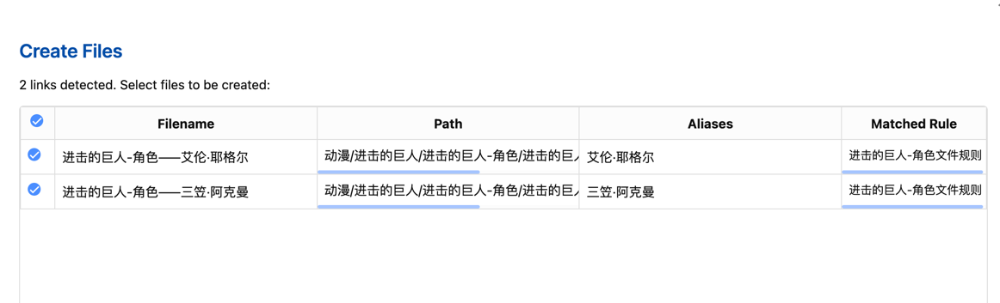
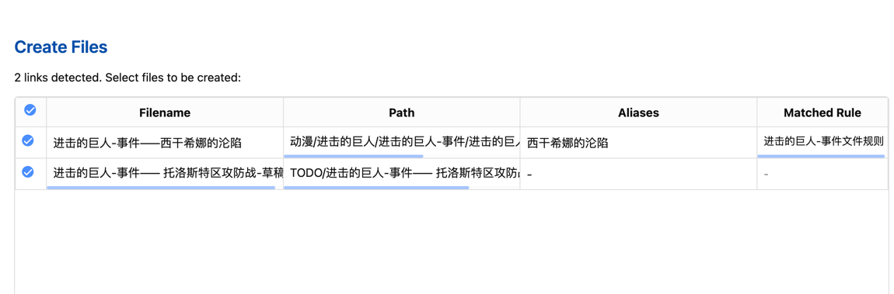
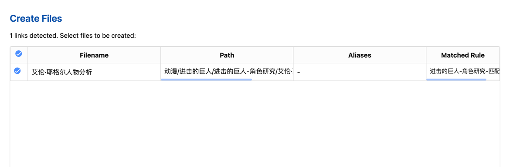

# 缺失链接文件创建器

[English](./README.md) | 中文

一个检测并创建笔记中缺失的 Markdown 文件链接的 Obsidian 插件。

## 功能特点

- **一键创建**笔记中引用的缺失文件
- **智能链接检测**支持多种链接格式：
	- 标准链接：`[[文件名]]`
	- 带别名的链接：`[[文件名|别名]]`
	- 带路径的链接：`[[路径/到/文件名]]`
	- 嵌入式链接：`![[文件名]]`
	- 资源目录中的链接：`[[资源/书籍/文件名]]`
- **批量创建**多个缺失文件
- **文件夹扫描**功能，可创建文件夹内所有笔记中缺失的链接
- **添加别名** - 自动将别名添加到文件的 frontmatter
- **自定义默认文件夹**用于新文件
- **交互式确认对话框**选择要创建的文件
- **模板支持** - 支持使用Templater模板自动填充新创建的文件
- **规则系统** - 根据文件名模式自动应用不同的目标文件夹和模板


## 安装

1. 打开 Obsidian 设置 > 第三方插件
2. 关闭安全模式
3. 点击"浏览"并搜索"Missing Link File Creator"
4. 安装插件并启用


## 使用方法

### 命令


| 命令                                       | 含义                                                         |
| ------------------------------------------ | ------------------------------------------------------------ |
| Create Files for Unresolved Links in Current File           | 检查当前打开的 Markdown 文档中的链接，自动创建尚未存在的关联文件。 |
| Scan Folder and Create Missing Files | 扫描当前打开文档所在文件夹内的所有 Markdown 文件，检测其关联链接，并自动创建尚未存在的文件。 |
|Manage File Creation Rules|打开规则管理面板，创建和编辑文件创建规则|

通过命令面板（Ctrl/Cmd + P）访问这些命令。


### 上下文菜单功能

- 在编辑器中选中包含`[[链接]]`的文本
- 右键单击打开上下文菜单
- 选择"Create Files for Selected Unresolved Links"(为选中的未解析链接创建文件)
- 系统将仅处理选中文本中的链接


## 配置

在插件设置中，您可以：

### 基本设置

1. **设置新文件的默认文件夹路径**：
	- 点击文件夹
	- 使用下拉菜单搜索并选择现有文件夹
	- 没有指定路径的文件将在此处创建

2. **启用文件创建通知**

3. **添加别名到frontmatter**：是否自动将链接中的别名添加到frontmatter中（与Templater配合使用时可禁用）

4. **启用调试模式**进行故障排除（开发者用）

### 模板设置

- **启用模板**：使用模板创建新文件
- **设置模板文件夹**：指定存放模板文件的文件夹

### 规则系统

- **启用规则**：根据文件名自动应用不同的目标文件夹和模板
- **管理规则**：添加、编辑和删除文件创建规则

### 文件创建规则

规则系统允许您根据文件名模式自动决定新文件的创建位置和使用的模板。

#### 创建规则

1. 在设置中点击"管理规则"按钮或使用命令面板中的"Manage File Creation Rules"
2. 点击"添加规则"按钮创建新规则
3. 配置规则内容：
- 规则名称：描述规则用途的名称
- 匹配条件：可配置多种匹配条件（包含、开头是、结尾是、精确匹配、正则表达式）
- 目标文件夹：匹配此规则的文件将创建在此文件夹
- 使用模板：指定用于创建文件的模板
- 模板别名处理：控制与Templater一起使用时如何处理别名

#### 规则匹配逻辑

- 多个规则按优先级顺序评估
- 每个规则可以包含多个条件（AND、OR、NOT、EXCLUDE）
- 第一个匹配的规则将被应用
- 可以通过上移/下移按钮调整规则优先级

#### 条件类型说明

创建规则时，可以使用多种条件类型灵活匹配文件名：

- **AND(且)**：所有条件必须满足
- **OR(或)**：至少一个条件满足
- **NOT(非)**：条件不能满足
- **EXCLUDE(排除)**：明确排除匹配条件的文件

这些条件可以组合使用，构建复杂的匹配逻辑。例如，可以创建规则匹配"包含'角色'但不以'NPC'开头的文件名"。


### 模板支持

插件现已支持使用模板创建新文件：

1. 在设置中启用"启用模板"选项
2. 设置包含模板文件的文件夹
3. 可以在规则中为特定文件名模式指定不同的模板
4. 支持基本变量替换，如{{filename}}、{{path}}和{{aliases}}
5. 与Templater插件集成，支持更强大的模板功能

### Templater集成

当安装并启用了Templater插件时，本插件会使用Templater处理模板，支持完整的Templater功能。您可以在规则中配置别名处理方式：

- 跳过：由Templater处理别名（推荐）
- 合并：将别名与模板frontmatter合并


#### Templater集成详情

当与Templater配合使用时，以下变量会自动传递给模板：

- `{{filename}}`：不含路径和扩展名的文件名
- `{{path}}`：文件的完整路径
- `{{aliases}}`：链接的别名列表，逗号分隔

在Templater模板中，可以通过TP.file.title、tp.file.path等访问这些变量，也可以使用以下方式：

```js
<%* 
// tp.frontmatter用于访问源文件的frontmatter
// 获取传递的别名
const aliases = tp.frontmatter.aliases;
%>
```


### 工作流示例

1. 编写带有计划稍后创建的文件链接的笔记：
   ```markdown
   我需要研究[[古代罗马]]及其与[[拜占庭帝国|拜占庭]]的联系。
   另外查看人物角色[[凯撒]]和[[庞培]]。
   ```

2. 设置规则，将所有包含"角色"的文件放在"Characters"文件夹中并使用"character"模板

3. 准备好创建这些文件时：

  - 运行"Create Files for Unresolved Links in Current File"命令
  - 在确认对话框中查看匹配的规则信息
  - 选择要创建的文件并确认
  - 文件将按规则创建在适当位置，使用指定模板


## 高级功能

### 前言数据(Frontmatter)匹配

规则系统支持根据源文件的frontmatter属性匹配文件：

1. 创建规则时选择"Frontmatter"匹配类型
2. 指定属性名和期望的值
3. 当源文件具有匹配的frontmatter时，规则将应用于创建的链接文件


### 上下文感知的文件创建

创建文件时插件会考虑：

- 源文件的frontmatter数据
- 源文件位置
- 指定的文件路径
- 匹配的规则

### 批量操作

- 通过规则可以统一管理大量链接文件的创建位置和内容模板
- 文件夹扫描模式可批量处理整个文件夹中的所有缺失链接


### 高级用法示例

#### 高级规则使用案例

##### 案例1: 小说写作项目的自动组织

**目标**: 为小说写作自动组织角色、地点和情节笔记

**规则设置**:

1. **角色笔记规则**:
- 规则名称: "进击的巨人-角色文件规则"
- 条件类型: "名称开头"
- 匹配模式: 文件名,"进击的巨人-角色——"
- 操作符: "AND"
- 目标文件夹: "动漫/进击的巨人/进击的巨人-角色"
- 使用模板: "Templates/Templater/M01-进击的巨人/Templater-M01：1001-进击的巨人-角色.md”
- 别名应用: 合并别名


```
- [[进击的巨人-角色——艾伦·耶格尔|艾伦·耶格尔]]  
    艾伦·耶格尔（Eren Yeager）是《进击的巨人》的主角，一个充满决心与复仇欲望的少年。生活在被巨型墙壁包围的世界中，他的母亲在巨人袭击中丧生，这激发了他加入调查兵团、对抗巨人的强烈意志。后来发现自己拥有变成巨人的能力，并继承了“进击的巨人”和“始祖巨人”的力量。艾伦的性格逐渐从单纯的热血青年转变为复杂且矛盾的存在，他的选择深刻影响了故事的走向。
    
- [[进击的巨人-角色——三笠·阿克曼|三笠·阿克曼]]  
    三笠·阿克曼（Mikasa Ackerman）是艾伦的童年好友兼保护者，以惊人的战斗天赋和对艾伦的忠诚而闻名。她是阿克曼家族的后裔，拥有超乎常人的力量和反应速度。幼年时父母被杀，艾伦救了她，从此她将艾伦视为家人，誓言守护他。三笠冷静果断，但在面对艾伦的安危时常显露情感，是作品中最强的战士之一。
```


**使用效果**:

-  `[[进击的巨人-角色——艾伦·耶格尔|艾伦·耶格尔]]`, `[[进击的巨人-角色——三笠·阿克曼|三笠·阿克曼]]` 等链接

  - 以“进击的巨人-角色——”开头，满足规则

    - 文件会被Templater使用对应的`Templater-M01：1001-进击的巨人-角色.md`模板补充数据

    - 为新文件添加别名

    - 这些文件会自动被分配到相应的文件夹`动漫/进击的巨人/进击的巨人-角色`





2. **事件笔记规则**:

- 规则名称: "进击的巨人-事件文件规则"
- 条件1: 文件名,"名称开头" + "进击的巨人-事件——" + "AND"
- 条件2: 文件名,"匹配" + "草稿" + "NOT"
- 目标文件夹: "动漫/进击的巨人/进击的巨人-事件"
- 使用模板: "Templates/Templater/M01-进击的巨人/Templater-M01：1002-进击的巨人-事件.md”


```
- [[进击的巨人-事件——西干希娜的沦陷|西干希娜的沦陷]]  
	- 《进击的巨人》故事围绕在艾伦·耶格尔，寄养于他家里的三笠·阿克曼以及他们的童年玩伴阿尔敏·阿诺德的冒险。在保护他们家乡的玛丽亚之墙被超大型巨人和铠之巨人摧毁后，艾伦见到自己的母亲被巨人吃掉，便发誓要杀光所有的巨人。
- [[进击的巨人-事件—— 托洛斯特区攻防战-草稿]] 
	- 艾伦与三笠和阿尔敏加入训练兵团，并在五年后毕业。此时巨人再度袭击靠近第二堵墙的托洛斯特区，在随后的战斗中，艾伦发现自己拥有变成巨人的能力，并保卫了该区。这引起调查兵团团长艾尔文的注意，艾尔文借助其力量夺回玛丽亚之墙，并让他受利威尔兵长和韩吉管辖。

```

**使用效果**:

-  `[[进击的巨人-事件——西干希娜的沦陷|西干希娜的沦陷]]`, `[[进击的巨人-事件—— 托洛斯特区攻防战-草稿]]` 等链接
  - 1. `[[进击的巨人-事件——西干希娜的沦陷|西干希娜的沦陷]]`匹配2条规则，会被模板创建、分配到指定位置
       - 文件会被Templater使用对应的`Templater-M01：1002-进击的巨人-事件.md`模板补充数据
       - 为新文件添加别名
       - 文件会自动被分配到相应的文件夹`动漫/进击的巨人/进击的巨人-事件`
    2. `[[进击的巨人-事件—— 托洛斯特区攻防战-草稿]]`匹配第1条规则，但不符合第2条规则，名称包含“草稿”
       - 没有匹配模板数据
       - 文件会自动被分配到默认配置的文件夹`TODO`





##### 案例2: 智能分类系统

**目标**: 根据文件名和分类自动组织笔记

**规则配置**:

1. **基于源文件frontmatter的规则**:
- 规则名称: "进击的巨人-角色研究-匹配规则"
- 条件1: "Frontmatter" + "series" + "进击的巨人" + "AND”
- 条件2: "包含" + "角色研究" + "AND" (匹配Frontmatter中的categories)
- 目标文件夹: "动漫/进击的巨人/进击的巨人-角色研究"
- 使用模板: "Templates/Templater/M01-进击的巨人/Templater-M01：1005-进击的巨人-角色研究.md”
- 模板别名处理: "合并"


```
---
title: 进击的巨人研究笔记
series: 进击的巨人
creator: 谏山创
categories: 
 - 动漫分析
 - 角色研究
status: ongoing
---

- [[艾伦·耶格尔人物分析]]

```


**使用效果**:

- `[[艾伦·耶格尔人物分析]]`这个链接在文档`进击的巨人研究笔记`中，该文档Frontmatter参数
  - categories=角色研究
  - series=进击的巨人
- 匹配满足规则“进击的巨人-角色研究-匹配规则”





### 注意事项

- 链接中带有特定路径的文件（如 `[[文件夹/文件]]`）将在这些位置创建
- 没有路径的文件将在您的默认文件夹中创建
- 除非您添加新的别名，否则插件不会覆盖现有文件
- 对于使用Templater，建议在模板中处理别名，以避免重复

## 支持

如果您遇到任何问题，请在 [GitHub 仓库](https://github.com/Lemon695/obsidian-missing-link-file-creator/issues)上报告。

# 插件应用场景

- **知识管理**：在编写知识笔记时，可快速创建和组织相关概念文件
- **小说写作**：写作过程中创建角色、地点、情节等相关文件
- **研究项目**：根据不同研究主题自动组织文件结构
- **课程笔记**：根据课程名称自动将笔记分类到适当文件夹

在进行文档编辑(如"小说写作")的过程中,一篇文章超过3000字,写作过程中创建了许多链接，例如 `[[角色设定]]` 或 `[[任务清单]]`，但这些文件尚未创建。通过这个插件，可以快速生成相关文件，而不必手动逐一创建，提升效率。

通过规则系统和模板支持，插件能大幅提升文件管理效率，让您专注于内容创作而非文件组织。


## 常见问题解答(FAQ)

**Q: 为什么我的链接没有被检测到？**  
A: 确保链接格式正确。本插件支持`[[链接]]`格式的Wiki链接，不支持标准Markdown链接`[文本](链接)`。

**Q: 创建文件时如何避免别名重复？**  
A: 当使用Templater时，建议在规则中选择"跳过"别名处理，让Templater负责处理别名，避免重复。

**Q: 如何对不同类型的笔记应用不同模板？**  
A: 创建多个规则，使用不同的匹配条件(如文件名包含特定关键词)，并为每个规则指定不同的模板。

**Q: 如何更改已创建规则的优先级？**  
A: 在规则管理界面中，使用每个规则旁边的上移/下移按钮调整规则顺序，列表顶部的规则优先级最高。


