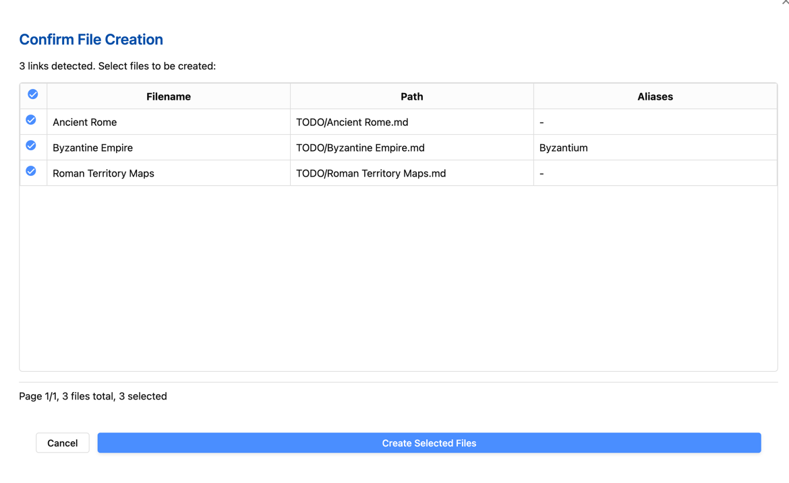

# 缺失链接文件创建器

[English](./README.md) | 中文

一个检测并创建笔记中缺失的 Markdown 文件链接的 Obsidian 插件。

## 功能特点

- **一键创建**笔记中引用的缺失文件
- **智能链接检测**支持多种链接格式：
	- 标准链接：`[[文件名]]`
	- 带别名的链接：`[[文件名|别名]]`
	- 带路径的链接：`[[路径/到/文件名]]`
	- 嵌入式链接：`![[文件名]]`
	- 资源目录中的链接：`[[资源/书籍/文件名]]`
- **批量创建**多个缺失文件
- **文件夹扫描**功能，可创建文件夹内所有笔记中缺失的链接
- **别名保留** - 自动将别名添加到文件的 frontmatter
- **可自定义默认文件夹**用于新文件
- **交互式确认对话框**选择要创建的文件


## 安装

1. 打开 Obsidian 设置 > 第三方插件
2. 关闭安全模式
3. 点击"浏览"并搜索"Missing Link File Creator"
4. 安装插件并启用


## 使用方法

### 命令


| 命令                                       | 含义                                                         |
| ------------------------------------------ | ------------------------------------------------------------ |
| Create Missing Links: Current File           | 检查当前打开的 Markdown 文档中的链接，自动创建尚未存在的关联文件。 |
| Create Missing Links: Folder Scan | 扫描当前打开文档所在文件夹内的所有 Markdown 文件，检测其关联链接，并自动创建尚未存在的文件。 |

通过命令面板（Ctrl/Cmd + P）访问这些命令。

### 配置

在插件设置中，您可以：

1. **设置新文件的默认文件夹路径**：
	- 点击文件夹字段
	- 使用下拉菜单搜索并选择现有文件夹
	- 没有指定路径的文件将在此处创建

2. **启用文件创建通知**

3. **启用调试模式**进行故障排除（开发者用）

### 工作流示例

1. 编写带有计划稍后创建的文件链接的笔记：
   ```markdown
   我需要研究 [[古代罗马]] 及其与 [[拜占庭帝国|拜占庭]] 的联系。
   另外查看! [[罗马领土地图]] 中的地图。
   ```

2. 准备好创建这些文件时：
	- 运行"创建缺失链接：当前文件"命令
	- 在确认对话框中选择要创建的文件
	- 文件将被创建，任何别名都会保留在 frontmatter 中




### 注意事项

- 链接中带有特定路径的文件（如 `[[文件夹/文件]]`）将在这些位置创建
- 没有路径的文件将在您的默认文件夹中创建
- 除非您添加新的别名，否则插件不会覆盖现有文件

## 支持

如果您遇到任何问题，请在 [GitHub 仓库](https://github.com/Lemon695/obsidian-missing-link-file-creator/issues)上报告。

# 插件应用场景 

在进行文档编辑(如"小说写作")的过程中,一篇文章超过3000字,写作过程中创建了许多链接，例如 `[[角色设定]]` 或 `[[任务清单]]`，但这些文件尚未创建。通过这个插件，可以快速生成相关文件，而不必手动逐一创建，提升效率。


